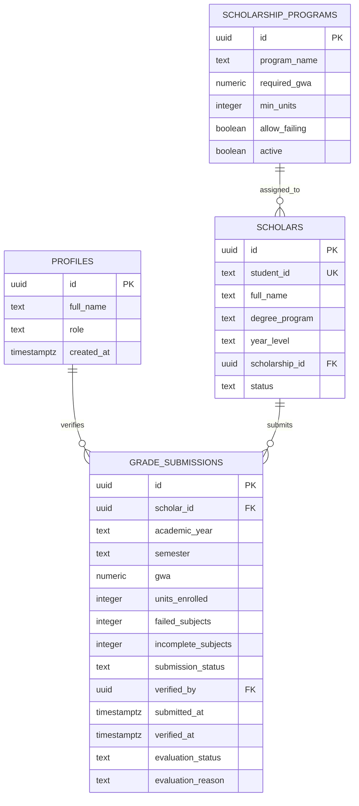

# Entity Relationship Diagram

```mermaid
erDiagram
    PROFILES ||--o{ GRADE_SUBMISSIONS : verifies
    SCHOLARSHIP_PROGRAMS ||--o{ SCHOLARS : assigned_to
    SCHOLARS ||--o{ GRADE_SUBMISSIONS : submits

    PROFILES {
      uuid id PK
      text full_name
      text role
      timestamptz created_at
    }

    SCHOLARSHIP_PROGRAMS {
      uuid id PK
      text program_name
      numeric required_gwa
      integer min_units
      boolean allow_failing
      boolean active
    }

    SCHOLARS {
      uuid id PK
      text student_id UK
      text full_name
      text degree_program
      text year_level
      uuid scholarship_id FK
      text status
    }

    GRADE_SUBMISSIONS {
      uuid id PK
      uuid scholar_id FK
      text academic_year
      text semester
      numeric gwa
      integer units_enrolled
      integer failed_subjects
      integer incomplete_subjects
      text submission_status
      uuid verified_by FK
      timestamptz submitted_at
      timestamptz verified_at
      text evaluation_status
      text evaluation_reason
    }
```
